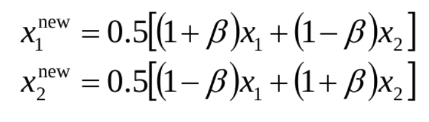
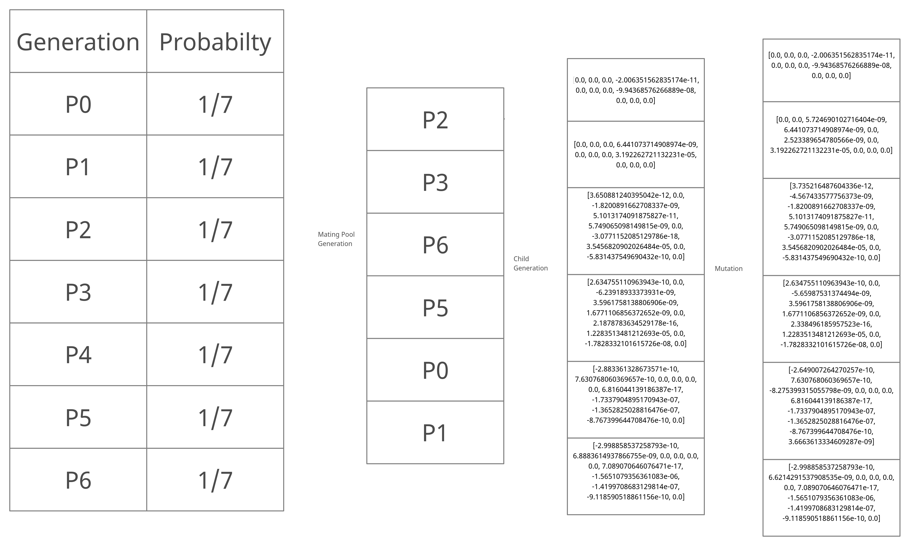
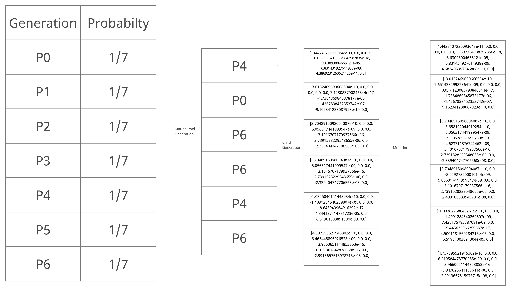
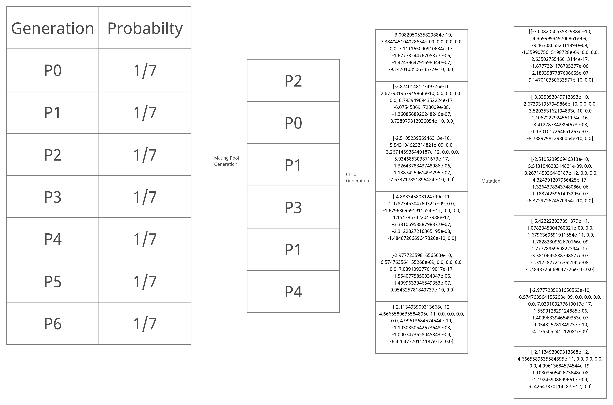

# Genetic algorithm
<b>Team Number 53</b>
<b>Kunwar Maheep Singh - 2019101075</b>
<b>Tushar Jain - 2019101091</b>

# Summary of our genetic algorithm

The genetic algorithm is a search heuristic that is inspired by Charles Darwin’s theory of natural evolution. This algorithm reflects the process of natural selection where the fittest individuals are selected for reproduction in order to produce offspring of the next generation.

<b>The stepwise explanation of our implementation is as follows :</b>

> *STEP 1: GENERATE INITIAL POPULATION*

We use the following code to generate the first generation.
```code
############# generate first generation
for i in range(0,GENERATION_SIZE):
    new.append(mutation_generation_first())
    # err = get_errors(SECRET_KEY_ID, new[i])
    # Generation.append([new[i], err[0], err[1], FITNESS_FACTOR*err[0]+err[1]])
```
The function `mutation_generation_first()` is the function that generates one mutated version of the initial overfit vector. The train and test errors of the new vector are obtained and pushed along with the vector and the fitness function, into the array called `Generation`. The code of `mutation_generation_first()` is the following:-

```code
def mutation_generation_first():
    new = []
    for i in range(0,MAX_DEG):
        if random.uniform(0,1) < 3/11:
            new.append(INITIAL_ARR[i] * random.uniform(0.9,1.1))
        else:
            new.append(0)
            # person[i] = person[i] + random.uniform(-deviation, deviation)
    return new
```
The way it generates a new vector is as follows. It goes through each gene of the initial vector and it selects the gene with a probability of 3/11. If it selects that gene, then it inserts that gene, after mutating it slightly into the vector that is to be generated. If it does not select that gene, then it simply puts zero in that place.

**After obtaining errors for this generation, we will use this generation as parents to generate the next generation**

> *STEP 2 : CROSSOVER OF THE PARENT GENERATION*

From the first generation, we first pick the top `MATING_POOL_SIZE` parent according to the fitness function value function values for each vector.
```code
Generation.sort(key = lambda x: x[3])
Generation = Generation[:MATING_POOL_SIZE]
```
Then, for every two vectors we want to generate, we chose two parents randomly from this pool of parents and use our crossover function to get two more vectors. We then push mutated versions of these two vectors into the new generation.
```code
rand1 = random.randint(0,int(len(Generation)))
rand2 = random.randint(0,int(len(Generation)))
# while(rand1==rand2):
#     rand2 = random.randint(0,int(len(Generation)))
children = crossover_two(Generation[rand1][0], Generation[rand2][0])
new.append(mutation_two(children[0]))
new.append(mutation_two(children[1]))
```
`crossover_two` is the crossover function. It is shown below.
```code
def crossover_two(parent1,parent2):
    child1 = []
    child2 = []
    u = random.uniform(0,1)
    n_c = 3
    beta = 0
    if u <=0.5:
        beta = (2 * u)**((n_c + 1)**-1)
    else:
        beta = ((2*(1-u))**-1)**((n_c + 1)**-1)
    
    for index,val in enumerate(parent1):
        child1.append(0.5*((1 + beta) * parent1[index] + (1 - beta) * parent2[index]))
        child2.append(0.5*((1 - beta) * parent1[index] + (1 + beta) * parent2[index]))
    
    return [child1,child2]
```
Here, we use **Simulated-Binary-Crossover** to generate two children from their parents.

This crossover is calculated as follows. we choose a random float between 0 and 1 called u, and we set a distribution index to an integer between 2 and 5 depending on how much variation we want the children to have from the parents. Then we calculate beta as follows :-


Then we find the children using the following formula



After finding the two new vectors we mutate them and add them to the new array, from where we will find their train and test errors, calculate their fitness, and proceed.

> *STEP 3 : GENERATING NEW GENERATION FROM OLD GENERATION AND NEWLY GENERATED CHILDREN*

Now, we select `OLD_GENERATION` number of vectors from the previous generation (the top `OLD_GENERATION` vectors), and the top `MATING_POOL_SIZE-OLD_GENERATION` from the children, and merge them together to get the newest generation. We then print out the generation and then use it to get the next generation.

```code
Generation.sort(key = lambda x: x[3])
Generation = Generation[:OLD_GENERATION]
Generation2 = []
for i, val in enumerate(new):
    # new.append(mutation(INITIAL_ARR, 0.5, 0.5))
    err = get_errors(SECRET_KEY_ID, new[i])
    Generation2.append([new[i], err[0], err[1], FITNESS_FACTOR*err[0]+err[1]])
    # print(get_errors(SECRET_KEY_ID, GENERATION[i]))
new = []
Generation2.sort(key = lambda x: x[3])
Generation2 = Generation2[:MATING_POOL_SIZE-OLD_GENERATION]
for val in Generation2:
    Generation.append(val)
print(str(j)+ " generation:")
Generation.sort(key = lambda x: x[3])
print(Generation)
```


# Mutations
We mutate children who have just been created by crossover using the `mutation_two` function. We handle mutating the initial population inside the population generating function itself. The code for the mutation function used to mutate children just created is shown below
```code
def mutation_two(child):
    for index, val in enumerate(child):
        if random.uniform(0,1) < 3/11:
            change = child[index] * random.uniform(0.9,1.1)
            if abs(change) <= 10:
                child[index] =  change
    return child
```
In different iterations and tries, we would manually change the probability and extent of mutation according to our needs.

# Crossover
The crossover function is the function applied on two parents to generate two children.

In our implementation, we choose random parents from a certain number of *fit* parents, and breed them together to create children.
`crossover_two` is the name of our crossover function. It is shown below.
```code
def crossover_two(parent1,parent2):
    child1 = []
    child2 = []
    u = random.uniform(0,1)
    n_c = 3
    beta = 0
    if u <=0.5:
        beta = (2 * u)**((n_c + 1)**-1)
    else:
        beta = ((2*(1-u))**-1)**((n_c + 1)**-1)
    
    for index,val in enumerate(parent1):
        child1.append(0.5*((1 + beta) * parent1[index] + (1 - beta) * parent2[index]))
        child2.append(0.5*((1 - beta) * parent1[index] + (1 + beta) * parent2[index]))
    
    return [child1,child2]
```
Here, we use **Simulated-Binary-Crossover** to generate two children from their parents.

This crossover is calculated as follows. we choose a random float between 0 and 1 called u, and we set a distribution index to an integer between 2 and 5 depending on how much variation we want the children to have from the parents. Then we calculate beta as follows :-


Then we find the children using the following formula


# Fitness Functions

Initially we used a fitness function of
```
err = 0.5*err1 + err2
```
Because we wanted to make the overfit vector not overfit the first dataset. After we reached a point where we thought that that had been achieved, we changed it to 
```
err = err1 + err2
```
and ran some iterations with this as the fitness function. Eventually we realised that we wanted the difference between the two errors to decrease, so then, we made the fitness function
```
err = |err1 - err2|
```

We would look at the errors generated by the vectors we were getting and would change the fitness function accordingly.

We even tried using the following fitness function, because we wanted to decrease the difference between the two errors and the sum of the two errors.
```
err = ((err1+err2)^2 + (err1-err2)^2)/2
```
which evaluates to 
```
err = err1^2 + err2^2
```

# HYPERPARAMETERS
```code
OLD_GENERATION = 5
FITNESS_FACTOR = 0.7
GENERATION_SIZE = 10
MATING_POOL_SIZE = 8
```

`OLD_GENERATION` - This dictates how many people we take from the previous generation into the new generation.
`FITNESS_FACTOR` - Most of the time, our fitness function was of the form `err = err1*FITNESS_FACTOR + err2`.
`GENERATION_SIZE` - This dictates the size of each generation.
`MATING_POOL_SIZE` - this dictates the number of people taken from a generation to mate.

# HEURISTICS APPLIED
These are the heuristics we applied while implementing this algorithm.

1. *Using different fitness functions, with different weights and forms* - We ran the algorithm with fitness functions like `err = |err1 - err2|` and `err = 0.5*err1 + err2` and `err = err1^2 + err2^2`
2. *Changing the fitness function midway* - We would change the fitness function mid-way depending on the errors we were getting. For example, if the errors were both low, but their difference was still considerable, we would change the fitness function into `err = |err1-err2|`. If the first error was very low and the second one was much higher we would change the fitness function to `err = 0.5*err1 + err2`.

3. *Changing degree of mutation* - We would slowly decrease the extent and probability of mutation depending on the errors we would get, when we thought we were reaching a local minima, we would decrease the extant of mutation, so that each generation would progress toward the local minima with more accuracy and not just jump the minima.

4. We  tried different ways to generate initial population, One was simply mutating every gene of the given vector to create new vectors. The other was the method explained.

# Statistical information

| ```GENERATION_SIZE``` | ```MATING_POOL_SIZE``` | ```FITNESS_FACTOR``` | ```OLD_GENERATION``` | *No. of generations generated* | *mutate range* | ```best vector's train error``` | ```best vector's validation error```| ``` file ```|
| 61 | 30 | 0.7 | 20 | 15 | 0.6 - 1.5 | 13774012976.725296 | 358076104887.1455 | new.txt |
| 10 | 8 | 0.7 | 5 | 5 | 0.1 - 1.9 | 13510782056.379528 | 368296116784.8584 | new2.txt |
| 20 | 15 | 0.7 and then 1| 10 | 8 | 0.8-1.2| 1334936486378.3198 | 853163051508.3177 | start_over.txt |
| 20 | 10 | 0.9 | 5 | 6 | 0.5 -  1.5 | 1817249537477.0261 | 1199621903563.672 | start_over2.txt |
| 8 | 5 | 0.7 | 3 | 21 | 0.8 - 1.2 | 1563419073850.1548 | 1612829796223.9739 | new_gene |


# DIAGRAMS FOR 3 CONSECUTIVE ITERATIONS




P0: [-2.868972896865714e-10, 0.0, 0.0, 0.0, 0.0, 0.0, 6.782030994416514e-17, 0.0, -1.3584695259592547e-07, -8.723648925481708e-10, 0.0]

P1: [-3.0132469690666504e-10, 7.651438299823641e-09, 0.0, 0.0, 0.0, 0.0, 7.123083790846344e-17, -1.7384869845878177e-06, -1.4267838452353742e-07, -9.162341238087923e-10, 0.0]

P2: [0, 0, 0, 0, 0, 0, 0, 0, 0, 0, 0]

P3: [0.0, 0.0, 0.0, 6.4210101992806225e-09, 0.0, 0.0, 0.0, 3.1823190353695626e-05, 0.0, 0.0, 0.0]

P4: [1.4427407220093648e-11, 0.0, 0.0, 0.0, 0.0, 0.0, -3.697334138392856e-18, 3.63093004665121e-05, 6.831431927611938e-09, 4.683405997546808e-11, 0.0]

P5: [3.7048915098004087e-10, 0.0, -8.059278500010144e-09, 5.056317441999547e-09, 0.0, 0.0, 3.1016707179937566e-16, 2.7391528229548655e-06, 0.0, -2.493108589549781e-08, 0.0]

P6: [-1.033627586432515e-10, 0.0, 0.0, -1.4091284540269807e-09, 7.426175783787081e-09, 0.0, -9.445635066259687e-17, 4.5001181560284315e-05, 0.0, 6.51961003891304e-09, 0.0]





P0: [-2.868972896865714e-10, 0.0, 0.0, 0.0, 0.0, 0.0, 6.782030994416514e-17, 0.0, -1.3584695259592547e-07, -8.723648925481708e-10, 0.0]

P1: [0, 0, 0, 0, 0, 0, 0, 0, 0, 0, 0]

P2: [0.0, 0.0, 0.0, 6.4210101992806225e-09, 0.0, 0.0, 0.0, 3.1823190353695626e-05, 0.0, 0.0, 0.0]

P3: [0, 0, 0, 0, 0, 0, 0, 3.2032258736217856e-05, 0, 0, 0]

P4: [0, 0, 0, 0, 0, 0, 0, 3.4570813481924274e-05, 0, 0, 0]

P5: [0.0, -7.74386787659763e-09, 0.0, 0.0, 0.0, 0.0, 0.0, 3.4779881864446505e-05, 7.772141218846794e-09, 0.0, 0.0]

P6: [3.7048915098004087e-10, 0.0, 0.0, 5.056317441999547e-09, 0.0, 0.0, 3.101670717993756e-16, 2.7391528229548655e-06, 0.0, -2.3394047477065678e-08, 0.0]




P0: [-2.868972896865714e-10, 0.0, 0.0, 0.0, 0.0, 0.0, 6.782030994416514e-17, 0.0, -1.3584695259592547e-07, -8.723648925481708e-10, 0.0]

P1: [-2.998858537258793e-10, 6.6214291537908535e-09, 0.0, 0.0, 0.0, 0.0, 7.089070646076471e-17, -1.5651079356361083e-06, -1.4199708683129814e-07, -9.118590518861156e-10, 0.0]

P2: [-3.0132469690666504e-10, 7.651438299823641e-09, 0.0, 0.0, 0.0, 0.0, 7.123083790846344e-17, -1.7384869845878177e-06, -1.4267838452353742e-07, -9.162341238087923e-10, 0.0]

P3: [0.0, 0.0, 0.0, -2.006351562835174e-11, 0.0, 0.0, 0.0, -9.94368576266889e-08, 0.0, 0.0, 0.0]

P4: [0, 0, 0, 0, 0, 0, 0, 0, 0, 0, 0]

P5: [2.634755110963943e-10, 0.0, -5.65987531374494e-09, 3.5961758138806906e-09, 1.6771106856372652e-09, 0.0, 2.338496185957523e-16, 1.2283513481212693e-05, 0.0, -1.7828332101615726e-08, 0.0]

P6: [3.735216487604336e-12, -4.567433577756373e-09, -1.8200891662708337e-09, 5.1013174091875827e-11, 5.749065098149815e-09, 0.0, -3.0771152085129786e-18, 3.5456820902026484e-05, 0.0, -5.831437549690432e-10, 0.0]
